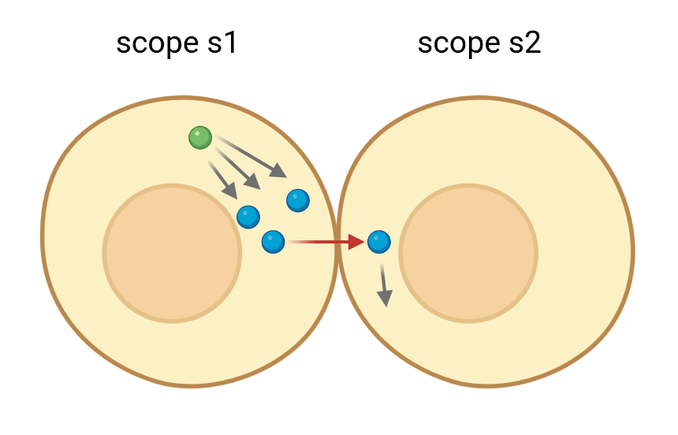

# Example 1
## High-level description
This simple example models a mock process involving two biological *scopes*, **s1** and **s2**.  
   
* s1 is the location where three **B molecules** (in blue) are produced through **process_1** (gray arrows in scope s1), 
  starting from one **A molecule**.
* B molecules are [*signaled*](https://en.wikipedia.org/wiki/Juxtacrine_signalling) (red arrow), to scope s2 by scope s1.
* In s2, B molecules are constantly degraded.

## Nets within nets formalism
The process described above is translated into Petri Nets as follows.  
  
* **p1 net** (left) is a Petri Net with a **process_1** transition getting black tokens from the input place **A_molecule**
and producing black tokens in the output place **B_molecule**
* **p2 net** (right) is a Petri Net with a **B_molecule_degradation** transition depleting black tokens from the input 
place **B_molecule**

  
* **s1** and **s2** scopes are places in the top-level Petri Net above.
* **p1_net** is a net token in palce s1
  * its evolution takes place in the s1 place (i.e. it does not move to place s2)
  * black tokens produced and consumed in p1_net places correspond to colored tokens (strings) in the top level s1 place
    * a low-level black token corresponds to a top-level colored token by the same name of the place it is prodcued or 
    consumed in
* **p2_net** is a net token in place s2
* the transition **juxtacrine_signaling_...** is enabled by *"A_molecule"* **colored tokens** from s1, and outputs the 
same colored tokens in the output place s2
  * note: the substitution rule *"protein", "receptor_active_protein"* has no effect in this example

## Running the example
Move to the example folder *e01* and run
```python
python3 main.py
```
