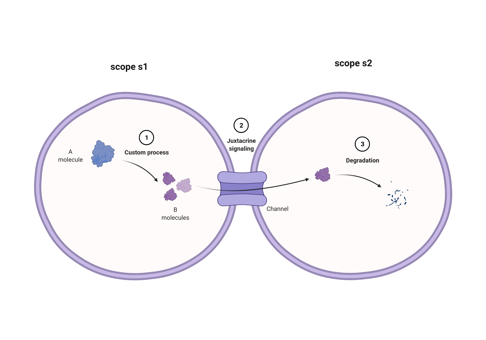
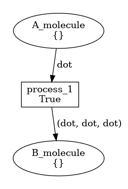
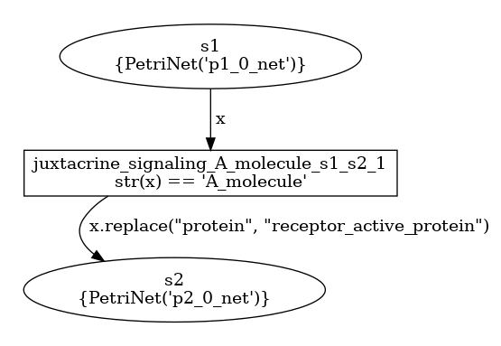

# Example 1
This simple example models a mock process involving two biological *scopes*, **s1** and **s2**.  
   
* s1 is the location where three **B molecules** are produced (1) starting from one **A molecule**.
* B molecules transit (2, [*Juxtacrine signaling*](https://en.wikipedia.org/wiki/Juxtacrine_signalling)) through a 
  communicating junction (*Channel*) from scope s1 to scope s2.
* In s2, B molecules are constantly degraded (3).  

##BiSDL representation
The process above can be described in BiSDL as follows ([source file](net.bisdl)).  
```
1     MODULE e01
2     TIMESCALE 10
3     SCOPE s1 (0, 0)
4         PROCESS p1
5             TIMESCALE 1
6             CUSTOM_PROCESS(A_molecule, 3*B_molecule)
7         JUXTACRINE_SIGNAL A_molecule -> s2
8     SCOPE s2 (0, 1)
9         PROCESS p2
10             TIMESCALE 1
11             DEGRADATION(B_molecule)
```

Lines 1-2 declare a MODULE *e01*, operating at a timescale that is 10-fold the base timescale in a given 
simulation context.  
The subsequent sections &mdash; lines 3-7 and 8-11 &mdash; describe each a SCOPE.
* SCOPE *s1*, placed at the arbitrary coordinates (0, 0), includes *p1* PROCESS (lines 4-6), and a signaling 
  mechanism (line 7).   
  * *p1* is the process through which *A_molecule* is transformed into 3 *B_molecule*s. It operates 
    at a 1:1 time step with respect to the simulation context.
  * the JUXTACRINE_SIGNALING construct models the contact-dependent signaling as in Fig. 1 above, releasing 
    *B_molecule*s to scope *s2*.
* *s2* includes the sole *p2* PROCESS
  * *p2* simply degrades *B_molecule*s.

## Nets within nets representation
The process described above is translated into the [nwn-snakes](https://github.com/leonardogian/nwn-snakes) 
Petri Net format as follows ([.py source code](net.py)).   
  
* **p1 net** (left) is a Petri Net with a **process_1** transition getting black tokens from the input place **A_molecule**
and producing black tokens in the output place **B_molecule**
* **p2 net** (right) is a Petri Net with a **B_molecule_degradation** transition depleting black tokens from the input 
place **B_molecule**

  
* **s1** and **s2** scopes are places in the top-level Petri Net above.
* **p1_net** is a net token in place s1
  * its evolution takes place in the s1 place (i.e. it does not move to place s2)
  * black tokens produced and consumed in p1_net places correspond to colored tokens (strings) in the top level s1 place
    * a low-level black token corresponds to a top-level colored token by the same name of the place it is produced or 
    consumed in
* **p2_net** is a net token in place s2
* the transition **juxtacrine_signaling_...** is enabled by *"A_molecule"* **colored tokens** from s1, and outputs the 
same colored tokens in the output place s2
  * note: the substitution rule *"protein", "receptor_active_protein"* has no effect in this example.

## Compile the example
Move to the example folder *e01* and run
```shell
python3 /path/to/bisdl2snakes.py net.bisdl [/path/to/dest]
```
to obtain the compiled [net.py](net.py) file.  
Use [nwn-petrisim](https://github.com/leonardogian/nwn-petrisim) to simulate the compiled module.
