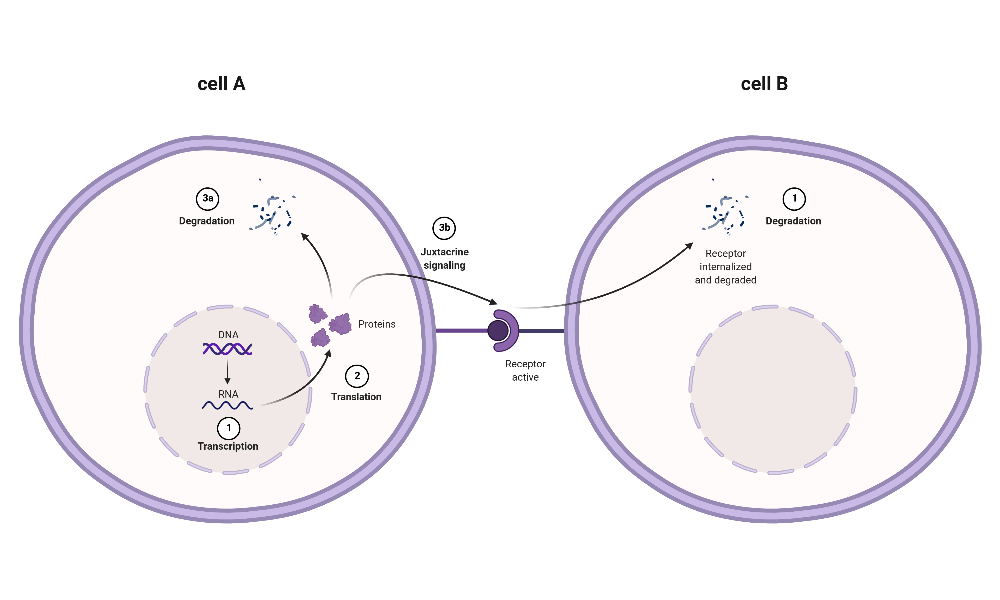
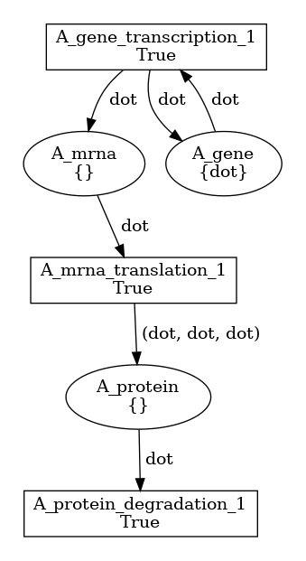
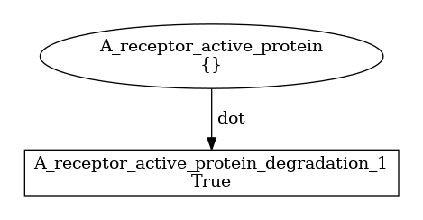
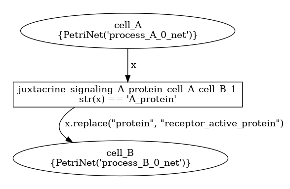

# Example 2
This example models a mock process involving two cells, **cell A** and **cell B**.  

* Cell A transcribes a gene to the corresponding mRNA (1)
* Cell A produces 3 proteins starting from an mRNA molecule (2)  
* Cell A can   
   * degrade the protein (3a)   
   * or (3b) place the protein specific ligand on its membrane. Cell B then binds it with the appropriate receptor 
   ([juxtacrine signaling](https://en.wikipedia.org/wiki/Juxtacrine_signalling)).  
* The active receptor is continuously degraded by cell B (1). 

## BiSDL representation  
The process above can be described in BiSDL as follows ([source file](net.bisdl)).  
```
1   MODULE e02
2   TIMESCALE 1
3   SCOPE cell_A (0, 0)
4       PROCESS process_A
5           TIMESCALE 1
6           TRANSCRIPTION(A_gene, A_mrna)
7           TRANSLATION(A_mrna, 3*A_protein)
8           DEGRADATION(A_protein)
9       JUXTACRINE_SIGNAL A_protein -> cell_B
10  SCOPE cell_B (0, 1)
11      PROCESS process_B
12          TIMESCALE 1
13          DEGRADATION(A_receptor_active_protein)
```

Lines 1-2 declare the MODULE *e02*, operating at a timescale that is 1:1 with respect to the base timescale in a given 
simulation context.  
The subsequent sections &mdash; lines 3-9 and 10-13 &mdash; describe each a SCOPE.
* SCOPE *cell_A*, placed at the arbitrary coordinates (0, 0), includes *process_A* PROCESS (lines 4-8), and the signaling 
  mechanism (line 9).   
  * *process_A* is the process through which *A_gene* is transcribed into an *A_mrna*, which in turn is translated into 
    3 *A_protein*s, that can undergo a degradation process. It operates at a 1:1 time step with respect to the simulation context.
  * the JUXTACRINE_SIGNALING construct models the contact-dependent signaling as in Fig. 1 above, activating cell
    surface receptor on *cell_B* membrane.
    * In BiSDL abstraction, for each *A_protein* consumed by *cell_A* in the signaling mechanism, one *A_receptor_active_protein*
    molecule is created in *cell_B* scope.
* *cell_B* includes the sole *process_B* PROCESS
  * *process_B* simply degrades *A_receptor_active_protein* molecules.

## Nets within nets representation
The process described above is translated into the [nwn-snakes](https://github.com/leonardogian/nwn-snakes) 
Petri Net format as follows ([.py source code](net.py)).   
  
* **process_A net** (left) is a Petri Net with
  * an **A_mrna_transcription** transition, getting black tokens from the input place **A_gene** and producing black 
    tokens in the output place **A_mrna**;
    * A black token is produced back to **A_gene** place, in order to model its existence as a blueprint (i.e., it is 
      used, not depleted). For the same reason, this place has by default one black token as its initial marking.  
  * an **A_mrna_translation** transition, that consumes one black token from **A_mrna** place producing 3 black tokens 
    into **A_protein** place;
  * an **A_protein_degradation** transition, consuming black tokens from **A_protein** place.
* **process_B net** (right) is a Petri Net with a **B_molecule_degradation** transition, depleting black tokens from 
  the input place **B_molecule**.

  
* **cell_A** and **cell_B** scopes are places in the top-level Petri Net above.
* **process_A_net** is a net token in place cell_A
  * its evolution takes place in the cell_A place (i.e. it does not move to place cell_B)
  * black tokens produced and consumed in process_A_net places correspond to colored tokens (strings) in the top level 
    cell_A place
    * a low-level black token corresponds to a top-level colored token by the same name of the place it is produced or 
    consumed in
* **process_B_net** is a net token in place cell_B
* the transition **juxtacrine_signaling_...** is enabled by *"A_protein"* **colored tokens** from cell_A, and outputs  
*"A_receptor_active_protein"* colored tokens in the output place cell_B

## Compile the example
Move to the example folder *e02* and run
```shell
python3 /path/to/bisdl2snakes.py net.bisdl [/path/to/dest]
```
to obtain the compiled [net.py](net.py) file.  
Use [nwn-petrisim](https://github.com/leonardogian/nwn-petrisim) to simulate the compiled module.
